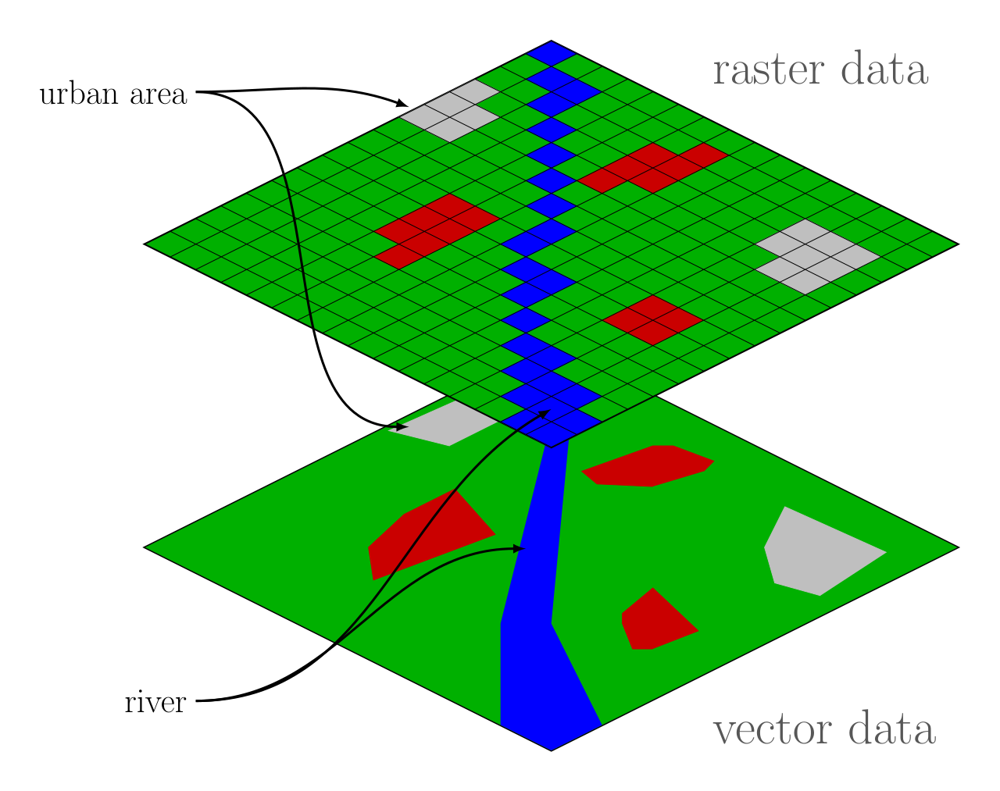

GIS
-----

This is a brief introduction to geospatial data which applied to both Python
and R. Geospatial data is information that also has a geographical component. 
Example include house proces, coupled to locations; roads and road types or hazard
assessment.

There are three things we need to learn about first:

 - vector data
 - raster data
 - projection spaces or coordinate spaces

Vector data
~~~~~~~~~~~~
.. index::
  single: GIS; vector

Vector data represent geometries via mathematicla objects. You can zoom
into a vector infinitely at it will remain infintely small! There are
three types of vector data:

 - points
 - lines
 - polygons

Vectors are most commonly stored as shapefiles: ``*.shp`` files. We call then shapefiles 
put they actually consist of a number of files. So a file called ``landslides.shp`` also
will have ``landslides.prj``, ``landslides.dbf`` and ``landslides.shx`` and a few more beside.
All files are required to fully define the shapefile.

Shapefiles often contain data alongside the vector representation. So for example, the shape
of buildings might be contained in the shapefile, but the polygons with the outline of the building
footprint might also contains the address, the price, the date built, etc.

Raster data
~~~~~~~~~~~~~
.. index::
  single: GIS; raster

Raster data are a grid of pixels of a resolution. Each pixel has a value, such as height
temperature, land use category, etc. The data are stored in *bands*, so a raster can contain
multiple datasets within the same structure and file. It's common for colour
images, such as satellite images, to be stored in a R(ed), G(reeen), and B(lue) bands.

The image below shows the difference between how data is stored in both raster
and vector formats; either can be used, but raster data have a "resolution" issue where
the size of the grid alters the accuracy of the data. However, raster data can store a
lot of data very efficiently, e.g. land hieght data where you need continuous measurements.

    
    Raster vs Vector for a land-use type dataset. From `Wikipedia`_ by `Johannes Rössel`_ (CC-BY-SA licence)

.. _Johannes Rössel: https://commons.wikimedia.org/wiki/User:Joey-das-WBF
.. _Wikipedia: https://en.wikipedia.org/wiki/Main_Page

Coordinate References System (CRS)
~~~~~~~~~~~~~~~~~~~~~~~~~~~~~~~~~~~
.. index::
  single: CRS
  single: coordinate reference system
  single: GIS; CRS

GIS is a 2D system. But the Earth is 3D; almost a sphere in fact. To display the 
3D surface to a 2D screen you need to project into a 2D space; the CRS. Any 
CRS required trade offs. You can preserve area or shape or distance, but not all three!
Compare the two projections of the Earth below; the Mollweide preserves areas, so the size of Greenland
to Africa is shown to scale, but you could not navigate using this map; your bearings
would be very wrong! The Mercator projection preserves areas; excellent for navigation, but
not so good for comparing areas. Greenland (2.1 million km\ :sup:`2`\ ) is not bigger than the whole of Africa
(30.1 million km\ :sup:`2`\ )!

In R and Python if you are doing operations on geospatial data they **must** be in the 
same project space. Your operation may work, but you won't get the result you want!

Common projection spaces are "mercator" and "Universal Tranverse Mercator (UTM)". For
"regional" studies UTM is best. It's in metres (not degrees!) and covers a reasonably 
large area with little deformation. 

.. figure:: ../images/Mollweide_projection_SW.jpg
    :alt: A global Mollweide projection which preserves area.
    
    Mollweide projection of the Earth, preserving areas. From `Wikipedia`_ by `Daniel R. Strebe`_ (CC-BY-SA licence)

.. _Daniel R. Strebe: https://commons.wikimedia.org/wiki/User:Strebe

.. figure:: ../images/Mercator_projection_Square.JPG
    :alt: A global Mercator projection which preserves angles.
    
    Mercator projection of the Earth, preserving angles. From `Wikipedia`_ by `Daniel R. Strebe`_ (CC-BY-SA licence)

.. _Daniel R. Strebe: https://commons.wikimedia.org/wiki/User:Strebe

